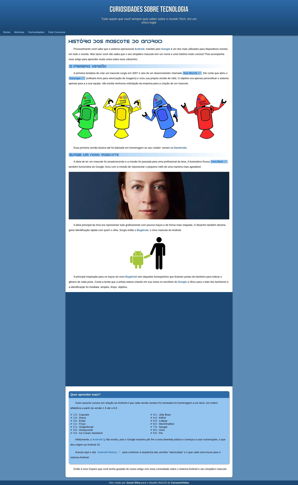

# 📰 Site de Notícias
<strong>Projeto site de notícias de tecnologia, criado no Capítulo 17 do Curso de HTML e CSS, do Curso em Video</strong> 🖖
- <a href="https://www.youtube.com/playlist?list=PLHz_AreHm4dkZ9-atkcmcBaMZdmLHft8n"><strong>Acesse aqui o curso!</strong><a>

 

 

> # <a href="https://josuedevgit.github.io/projeto-android/">Acesse aqui o projeto!</a>

 

## 🔨⚒ Tools:

 

>### Insights 💡:
- Aqui o Box-Model foi a chave! Trabalhamos todos os aspectos do HTML5 semântico, aninhamento, modelo de caixas e alinhamentos
- Foi bacana podermos aplicar os conceitos de design, tipografia e cores
- Usando variáveis, facilitamos mais ainda a otimização do trabalho

 

>## 📩 Contato do Desenvolvedor:
- josueluzsilva.01@gmail.com
